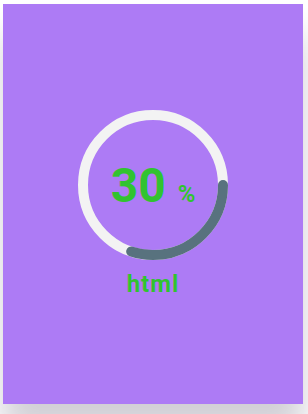
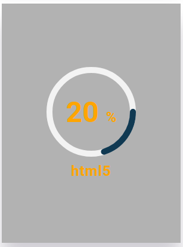
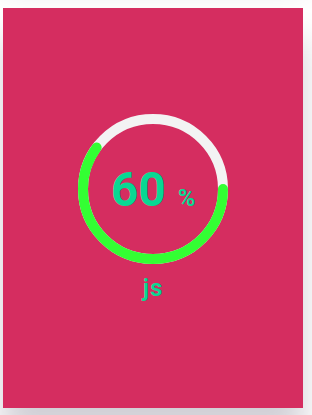

# CircleProgressBar

Small component to display **circle progress bars**, completely responsive.

<div style="display:flex;flex-direction:row;justify-content:center;align-items:center;">



</div >


## Installation

You can install this component in your project with the fallowing command:

```console

npm i @torrez_mn/circle_progress_bar

```

or by:

```console

npm install @torrez_mn/circle_progress_bar

```

## Usage

In your component, you can import the component as fallows:

```JavaScript

import "@torrez_mn/circle_progress_bar";

```

then you cand work with the tomponent.

### With required props.
- Required props to work. 

```JavaScript

{/*With required props.*/}
<cp-card cp-percentaje="30" cp-skill="html" />

```

### With optional props.
- Optional props to work. 

```JavaScript

{/*With optional props.*/}

  <cp-card
    cp-percentaje="20"
    cp-skill="html5"
    cp-text-color="orange"
    cp-background="rgba(0,0,0,.3)"
  />

```


## DEMO
***See a *Code Sandbox* React demo [here.](https://wg5103.csb.app/)***

## Docs

Brief description of the component's props.


| prop | description | required |
|------|-------------|----------|
|cp-percentaje|The percentaje value to be drawn by the progress bar.| REQUIRED|
|cp-skill|Percentaje description to show behind value.|REQUIRED|
|cp-text-color|Color of text, value and bar color in the component.|OPTIONAL|
|cp-background|Color of the card background.|OPTIONAL|
